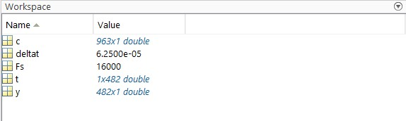
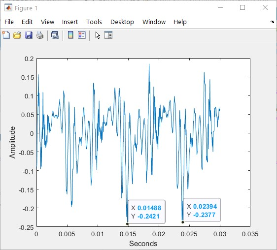
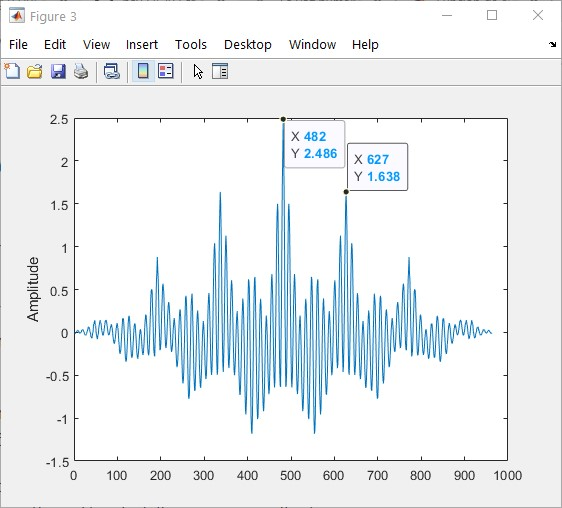
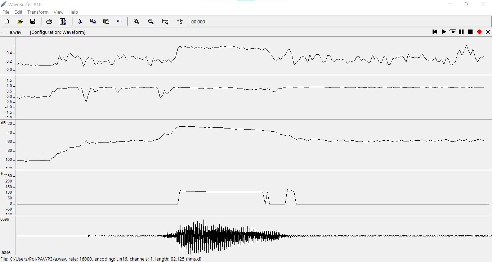
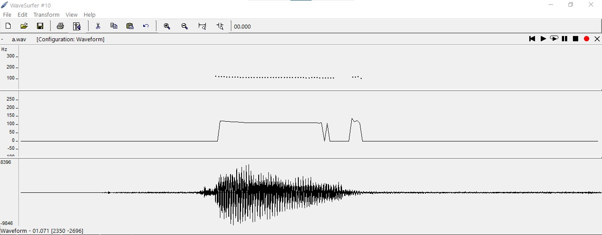
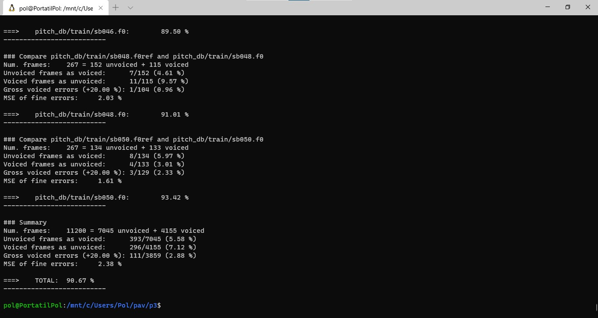
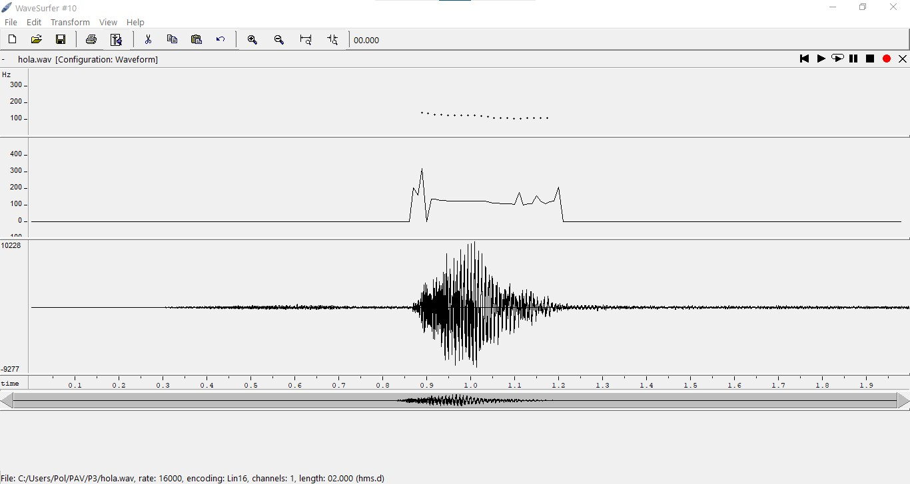

PAV - P3: detección de pitch
============================

Esta práctica se distribuye a través del repositorio GitHub [Práctica 3](https://github.com/albino-pav/P3).
Siga las instrucciones de la [Práctica 2](https://github.com/albino-pav/P2) para realizar un `fork` de la
misma y distribuir copias locales (*clones*) del mismo a los distintos integrantes del grupo de prácticas.

Recuerde realizar el *pull request* al repositorio original una vez completada la práctica.

Ejercicios básicos
------------------

- Complete el código de los ficheros necesarios para realizar la detección de pitch usando el programa
  `get_pitch`.

   * Complete el cálculo de la autocorrelación e inserte a continuación el código correspondiente.
 
 El cálculo de la autocorrelación se define como la correlación cruzada de la señal consigo misma con un pequeño desplazamiento. Por lo que hemos ido recorriendo la señal por encima de ella misma, usando la función for. En cada muestra de la señal, hemos ido realizando los productos, para hacer la convolución. Y finalmente, hemos dividido el resultado entre el número de muestras de la señal.
 
 
```c
 void PitchAnalyzer::autocorrelation(const vector<float> &x, vector<float> &r) const {
    for (unsigned int l = 0; l < r.size(); ++l) {

      r[l] = 0;

      for (unsigned int k = 0; k < x.size() - l -1; ++k) {
  		/// \TODO Compute the autocorrelation r[l]
      r[l] = x[k] * x[k+l] + r[l];
    }
     r[l] = r[l] / x.size();
    }
    if (r[0] == 0.0F) //to avoid log() and divide zero 
      r[0] = 1e-10; 
  }
  ```
  
   * Inserte una gŕafica donde, en un *subplot*, se vea con claridad la señal temporal de un segmento de
     unos 30 ms de un fonema sonoro y su periodo de pitch; y, en otro *subplot*, se vea con claridad la
	 autocorrelación de la señal y la posición del primer máximo secundario.

	 NOTA: es más que probable que tenga que usar Python, Octave/MATLAB u otro programa semejante para
	 hacerlo. Se valorará la utilización de la librería matplotlib de Python.
	
 El código MATLAB usado es el siguiente:
  
  ```c
[y,Fs] = audioread('a30ms.wav');
deltat=1/Fs;
t=0:deltat:(length(y)*deltat)-deltat;
subplot(2,1,1);
plot(t,y); title('Signal Vocal A 30 ms'); xlabel( 'Seconds'); ylabel('Amplitude');
subplot(2,1,2);
c = xcorr(y);
plot(c); title('Autocorrelation'); ylabel('Amplitude');
  ```
Donde las variables toman los siguientes valores:
  


Las gráficas conseguidas son las siguientes: 





En las gráficas podemos ver que el periodo de pitch es aproximadamente 9ms, por lo que como el pitch=1/T, aproximadamente la función tendrá un pitch de 110,37 Hz.




Después de ver la gráfica de la autocorrelación vemos que el valor de pitch que habíamos calculado es aproximadamente parecido al que se ve en esta gráfica que es de 110,34 Hz.
  
   * Determine el mejor candidato para el periodo de pitch localizando el primer máximo secundario de la
     autocorrelación. Inserte a continuación el código correspondiente.
     
  ```c
vector<float>::const_iterator iR = r.begin() + npitch_min, iRMax = iR;

    /// \TODO 
	/// Find the lag of the maximum value of the autocorrelation away from the origin.<br>
	/// Choices to set the minimum value of the lag are:
	///    - The first negative value of the autocorrelation.
	///    - The lag corresponding to the maximum value of the pitch.
    ///	   .
	/// In either case, the lag should not exceed that of the minimum value of the pitch.

  while (iR != r.end())
  {
    if(*iR > *iRMax)
    {
      iRMax = iR;           //Establecemos el nuevo máximo encontrado                  
    }
    iR++;                   //Seguimos iterando para ver si hay otro máximo
  }

    unsigned int lag = iRMax - r.begin();

    float pot = 10 * log10(r[0]);
  ```
   
   Para encontrar el primer máximo secundario de la correlación, hacemos una iteración que recorra todos los valores. Dentro de la iteración comparamos los valores almacenando el que nos ha dado valor mayor. A continuación, guardamos la posición y calculamos la potencia de la señal.
   
   * Implemente la regla de decisión sonoro o sordo e inserte el código correspondiente.
   
 ```c
bool PitchAnalyzer::unvoiced(float pot, float r1norm, float rmaxnorm) const {
    /// \TODO Implement a rule to decide whether the sound is voiced or not.
    /// * You can use the standard features (pot, r1norm, rmaxnorm),
    ///   or compute and use other ones.

    if(( rmaxnorm > 0.5F || r1norm > 0.92F) && pot > -48.0F )
      return false;
    else
      return true;
    
  }
  ```


Para saber si un sonido es sordo o sonoro, nos basamos en la potencia de la señal. Si el sonido es sonoro tendrá mayor potencia que si es sordo. Asimismo, miramos si la función de autocorrelación tiene dos máximos superiores a cierto valor. Ya que si es sonoro tendrá pitch. 


- Una vez completados los puntos anteriores, dispondrá de una primera versión del detector de pitch. El 
  resto del trabajo consiste, básicamente, en obtener las mejores prestaciones posibles con él.

  * Utilice el programa `wavesurfer` para analizar las condiciones apropiadas para determinar si un
    segmento es sonoro o sordo. 
	
	  - Inserte una gráfica con la detección de pitch incorporada a `wavesurfer` y, junto a ella, los 
	    principales candidatos para determinar la sonoridad de la voz: el nivel de potencia de la señal
		(r[0]), la autocorrelación normalizada de uno (r1norm = r[1] / r[0]) y el valor de la
		autocorrelación en su máximo secundario (rmaxnorm = r[lag] / r[0]).

		Puede considerar, también, la conveniencia de usar la tasa de cruces por cero.

	    Recuerde configurar los paneles de datos para que el desplazamiento de ventana sea el adecuado, que
		en esta práctica es de 15 ms.
		


`Audio con el sonido 'a'; Pitch calculado; Potencia; r1norm = r[1] / r[0]; rmaxnorm = r[lag] / r[0](Orden de abajo a arriba)`

  - Use el detector de pitch implementado en el programa `wavesurfer` en una señal de prueba y compare
	    su resultado con el obtenido por la mejor versión de su propio sistema.  Inserte una gráfica
		ilustrativa del resultado de ambos detectores.
		
  
  
  * Optimice los parámetros de su sistema de detección de pitch e inserte una tabla con las tasas de error
    y el *score* TOTAL proporcionados por `pitch_evaluate` en la evaluación de la base de datos 
	`pitch_db/train`..
	
```c
bool PitchAnalyzer::unvoiced(float pot, float r1norm, float rmaxnorm) const {
    /// \TODO Implement a rule to decide whether the sound is voiced or not.
    /// * You can use the standard features (pot, r1norm, rmaxnorm),
    ///   or compute and use other ones.

    if(( rmaxnorm > 0.5F || r1norm > 0.92F) && pot > -48.0F )
      return false;
    else
      return true;
    
  }
  ```
  

Tal como podemos ver en la imagen, los resultados obtenidos son bastante favorables, ya que son superiores al 90%. 
  
   * Inserte una gráfica en la que se vea con claridad el resultado de su detector de pitch junto al del
     detector de Wavesurfer. Aunque puede usarse Wavesurfer para obtener la representación, se valorará
	 el uso de alternativas de mayor calidad (particularmente Python).
   
  `Audio con el la palabra hola.`
  
  
  
  

Ejercicios de ampliación
------------------------

- Usando la librería `docopt_cpp`, modifique el fichero `get_pitch.cpp` para incorporar los parámetros del
  detector a los argumentos de la línea de comandos.
  
  Esta técnica le resultará especialmente útil para optimizar los parámetros del detector. Recuerde que
  una parte importante de la evaluación recaerá en el resultado obtenido en la detección de pitch en la
  base de datos.

  * Inserte un *pantallazo* en el que se vea el mensaje de ayuda del programa y un ejemplo de utilización
    con los argumentos añadidos.

- Implemente las técnicas que considere oportunas para optimizar las prestaciones del sistema de detección
  de pitch.

  Entre las posibles mejoras, puede escoger una o más de las siguientes:

  * Técnicas de preprocesado: filtrado paso bajo, *center clipping*, etc.
  * Técnicas de postprocesado: filtro de mediana, *dynamic time warping*, etc.
  * Métodos alternativos a la autocorrelación: procesado cepstral, *average magnitude difference function*
    (AMDF), etc.
  * Optimización **demostrable** de los parámetros que gobiernan el detector, en concreto, de los que
    gobiernan la decisión sonoro/sordo.
  * Cualquier otra técnica que se le pueda ocurrir o encuentre en la literatura.

  Encontrará más información acerca de estas técnicas en las [Transparencias del Curso](https://atenea.upc.edu/pluginfile.php/2908770/mod_resource/content/3/2b_PS%20Techniques.pdf)
  y en [Spoken Language Processing](https://discovery.upc.edu/iii/encore/record/C__Rb1233593?lang=cat).
  También encontrará más información en los anexos del enunciado de esta práctica.

  Incluya, a continuación, una explicación de las técnicas incorporadas al detector. Se valorará la
  inclusión de gráficas, tablas, código o cualquier otra cosa que ayude a comprender el trabajo realizado.

  También se valorará la realización de un estudio de los parámetros involucrados. Por ejemplo, si se opta
  por implementar el filtro de mediana, se valorará el análisis de los resultados obtenidos en función de
  la longitud del filtro.
   

Evaluación *ciega* del detector
-------------------------------

Antes de realizar el *pull request* debe asegurarse de que su repositorio contiene los ficheros necesarios
para compilar los programas correctamente ejecutando `make release`.

Con los ejecutables construidos de esta manera, los profesores de la asignatura procederán a evaluar el
detector con la parte de test de la base de datos (desconocida para los alumnos). Una parte importante de
la nota de la práctica recaerá en el resultado de esta evaluación.
